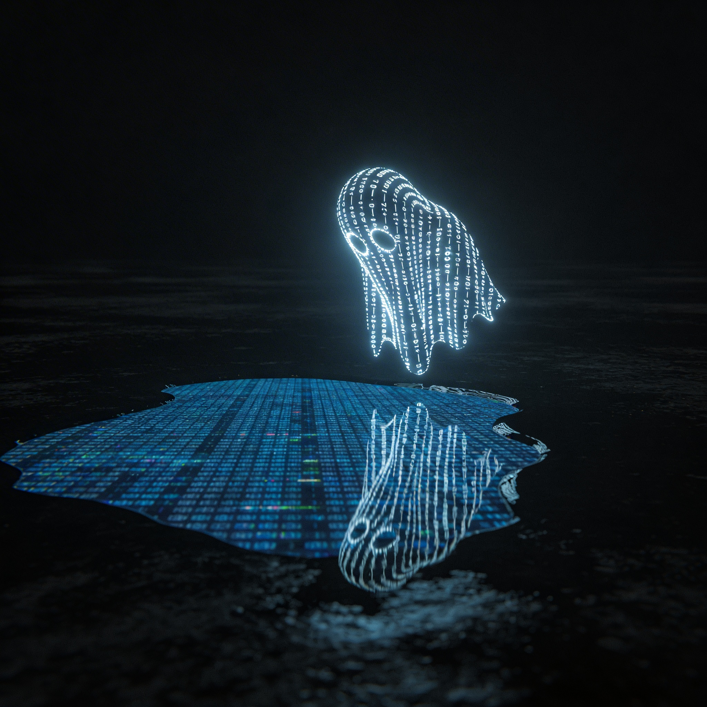

# ghostcode.ai splash page

Cinematic splash page for ghostcode.ai. A ghost made of a flowing text matrix floats above a digital puddle, the camera orbits and dives overhead, and the scene resolves into an interactive title card.

### Inspiration

Generated with Nano Banana + Kling 3.0:

[](https://github.com/ghostcode-ai/ghostcode/raw/main/media/ghostcode.mp4)

## Quick start

```bash
npm install
npm run dev        # http://localhost:3000
```

## How it works

The entire animation is a single Canvas 2D engine (`src/lib/engine.ts`) mounted by a React component. No WebGL, no Three.js -- just `fillText`, `drawImage`, radial gradients, and math.

### Ghost shape

The ghost is defined by a **signed distance field (SDF)** evaluated in real-time. The SDF combines:

- A large elliptical dome (head)
- A tapered bell body with wind-trailing shift
- A wavy hem at the bottom (4 layered sine waves) that flutters like fabric
- Two oval eye voids
- Organic edge noise

The whole shape is tilted ~8 degrees for personality. The SDF returns a raw distance, a binary mask, an eye mask, a **rim lighting** value (bright at edges, dim inside for 3D depth), and a glow falloff field.

### Text rendering

Text flows through the ghost shape using horizontal bands. For each screen-space row that intersects the ghost:

1. `ghostWidthAtY()` finds the left/right extent of the ghost SDF at that Y (cached every N frames)
2. Characters are stamped across that width using a **bitmap character atlas** (pre-rendered to an offscreen canvas in `buildAtlas()`)
3. Each character's brightness comes from the SDF rim lighting value at the line center
4. A time-based scroll offset shifts each row's character index, creating the flowing text effect

The character set is ASCII: `0110100101 GHOST CODE AI {fn}=>[void] 0xDEAD /|<>+{}[]`.

### Puddle

The puddle is an elliptical region clipped by `ctx.ellipse()` + `ctx.clip()`. Its character grid is pre-rendered to an **offscreen canvas** every ~10 frames (the grid barely changes frame-to-frame), then stamped onto the main canvas with a single `drawImage` call. This avoids ~3000 individual `fillText` calls per frame.

The ghost reflection in the puddle uses the same SDF evaluated at a mirrored Y position, with sinusoidal water distortion displacing each character.

### Camera system

A virtual camera provides:

- **Zoom**: single continuous power curve (cubic ease-in, no seams)
- **Vertical pan**: smoothstep from ghost center to puddle
- **Lateral orbit**: horizontal offset that sweeps right-to-left, creating a drone fly-in feel
- **Parallax**: objects at different virtual depths shift at different rates during the orbit. Ghost (depth=1) shifts 1.6x more than the puddle (depth=0)
- **Perspective compression**: the ghost squashes vertically as the camera tilts overhead

All camera parameters use `smoothstep` easing that extends slightly past `progress=1.0` so the animation ends while still gently moving (no hard stop).

### Ghost lifelike motion

The ghost floats with layered incommensurate sine waves:
- Slow lateral drift (0.2 Hz, 0.53 Hz)
- Breathing vertical bob (0.45 Hz, 0.83 Hz, 1.7 Hz)
- Weight-shifting sway
- Breathing scale oscillation (1.5% expansion/contraction)

The bottom of the SDF has edge ripple that increases toward the hem, making the body sides flutter like fabric.

### Title mask ("GHOSTCODE")

After the intro animation, a dark overlay fades in with letter-shaped holes punched via Canvas 2D `destination-out` compositing. The moving puddle characters show through the letter shapes, creating the effect of text flowing inside the word "GHOSTCODE". The font is Impact at 80% screen width.

### Interactive loop

Clicking the GHOSTCODE title triggers:

1. Mask fades out (1.5s)
2. Ghost enters from a random screen edge, flies a **quadratic bezier curve** to the farthest corner's edge, with sinusoidal wandering displacement
3. A shadow/reflection follows on the ground plane below
4. Ghost exits off-screen
5. After 2s pause, the title mask fades back in
6. Cycle repeats with a new random path each time

The exit point is computed by finding the screen vertex farthest from entry, then picking a random point up to 50% along one of its two edges.

### Performance notes

Canvas 2D `fillText` is expensive. Key optimizations:

- **Bitmap character atlas**: characters pre-rendered once, stamped via `drawImage`
- **Puddle offscreen cache**: grid text rendered every ~10 frames to an offscreen canvas
- **Ghost width cache**: SDF edge-finding results cached for ~4 frames
- **DPR=1**: retina rendering disabled for now (2x fewer pixels)
- **Coarse SDF sampling**: ghost width uses 5% step size instead of 1%

For 60fps at high density, the correct architecture would be WebGL with instanced quads. The current Canvas 2D approach runs at ~15-30fps on desktop.

## File structure

```
src/
  app/
    layout.tsx          Root layout, Google Fonts (Space Mono, Syne)
    page.tsx            Mounts SplashExperience
    globals.css         CSS variables (midnight moonlight palette), base styles
  components/
    SplashExperience.tsx  Canvas mount, engine lifecycle, loading screen
    SplashOverlay.tsx     Brand + nav overlay (currently hidden)
  lib/
    engine.ts           The entire animation engine (~1000 lines)
```

## Color palette

| Name | Hex | Usage |
|------|-----|-------|
| Void Black | `#050510` | Background |
| Midnight Navy | `#0A0F2E` | Secondary depth |
| Deep Steel | `#1A2744` | Mid shadow |
| Dusty Blue | `#3B5998` | Particle trail |
| Moonlit Blue | `#7EB8E0` | Primary glow |
| Ice Blue | `#C8E0FF` | Character cores |
| Peak White | `#FFFFFF` | Hottest highlight |
| Cyan | `#00C8FF` | Puddle grid |
